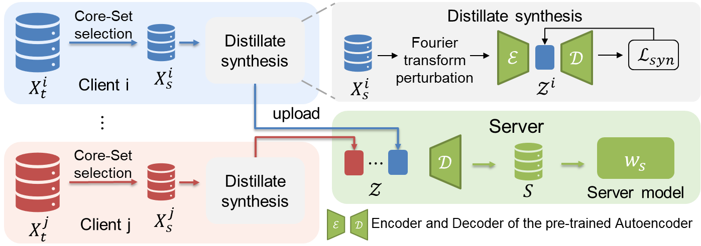

<h1 align="center">
     One-shot Federated Learning via Synthetic Distiller-Distillate Communication
</h1>

This repository contains the code for the paper "**(NeurIPS 2024) One-shot Federated Learning via Synthetic Distiller-Distillate Communication**".



## Installation

### Dependencies

 - Python (3.8)
 - PyTorch (2.4.0)
 - numpy (1.24.3)

### Install requirements

Run the following command to install the required packages:

`pip install -r requirements.txt` 

## Run Code

### Step1 Local Training

**This step performs local training on each client first. The trained client models are saved and will be reused by all one-shot federated learning algorithms in later steps.**

```bash
# bash
bash shells/tiny_ensemble.sh

# python
python oneshot_main.py \
      -c configs/imagenette/ensemble.yaml \ # config file
      -dda 0.1 \ # dirichlet dataset alpha
      -md ResNet18 \ # model name
      -is 42 \ # seed
      -sn Baseline_Ensemble_dir0.1_nc10 \ # save name
      -g 0 \ # cuda id
      -nc 10 \ # number of clients
      --save_client_model # save trained client models
```

### Step2 One-shot Federated Learning

**After performing local training, this step evaluates the performance of different one-shot federated learning algorithms.**

```bash
# FedSD2C
# bash
bash shells/tiny_fedsd2c.sh

# python
python fedsd2c_main.py \
      -c configs/tinyimagenet/fedsd2c.yaml \ # config file
      -dda 0.1 \ # dirichlet dataset alpha
      -md Conv4 \ # model name
      -is 42 \ # seed
      -sn fedsd2c \ # save name
      -g 0 \ # cuda id
      -cis coreset+dist_syn \ # distiller distillation stage which is one of ['coreset', 'coreset+dist_syn']
      -cmr train_results/Baseline_Ensemble_dir0.1_nc10_ENSEMBLE_Conv4_TINYIMAGENET_s42 \ # saved model path
      --fedsd2c_ipc 50 \ # IPC
      --fedsd2c_inputs_init vae+fourier # apply fourier transform perturbation

# DENSE
# bash
bash shells/tiny_dense.sh

# python
python oneshot_main.py \
      -c configs/tinyimagenet/dense.yaml \
      -dda 0.1 \
      -md Conv4 \
      -is 42 \
      -sn Baseline_DENSE_dir0.1_nc10 \
      -g 0 \
      -nc 10 \
      -cmr train_results/Baseline_Ensemble_dir0.1_nc10_ENSEMBLE_Conv4_TINYIMAGENET_s42
```

## Citation
 ```bibtex
@inproceedings{NEURIPS2024_ba0ad9d1,
 author = {Zhang, Junyuan and Liu, Songhua and Wang, Xinchao},
 booktitle = {Advances in Neural Information Processing Systems},
 editor = {A. Globerson and L. Mackey and D. Belgrave and A. Fan and U. Paquet and J. Tomczak and C. Zhang},
 pages = {102611--102633},
 publisher = {Curran Associates, Inc.},
 title = {One-shot Federated Learning via Synthetic Distiller-Distillate Communication},
 url = {https://proceedings.neurips.cc/paper_files/paper/2024/file/ba0ad9d1e0c737800b2340b9cd68c208-Paper-Conference.pdf},
 volume = {37},
 year = {2024}
}
```

## Acknowledgement
The project is based on the [FedD3](https://github.com/rruisong/FedD3) repository.


